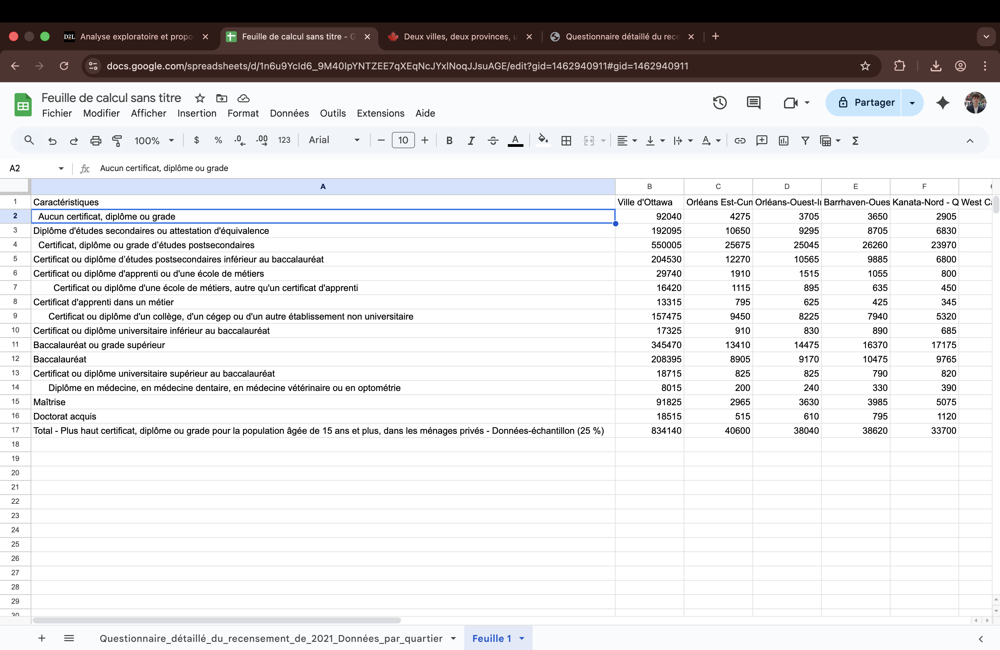
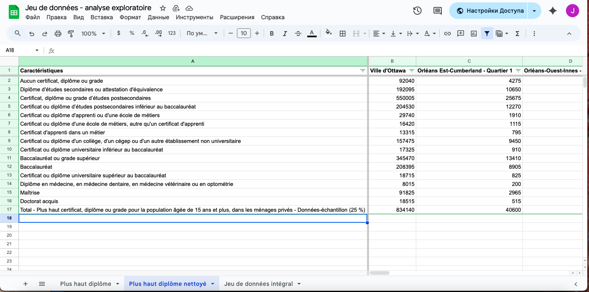
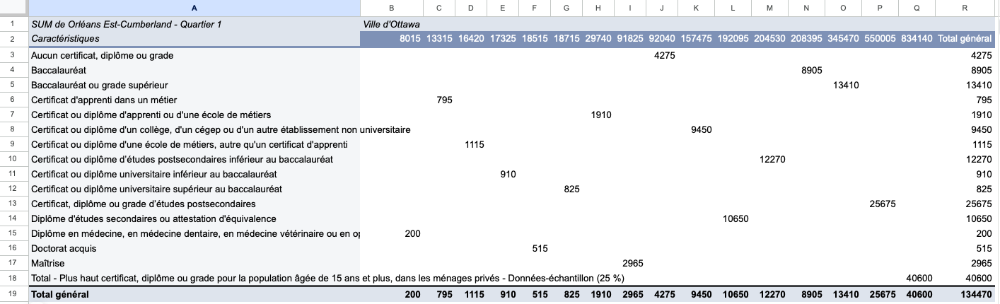
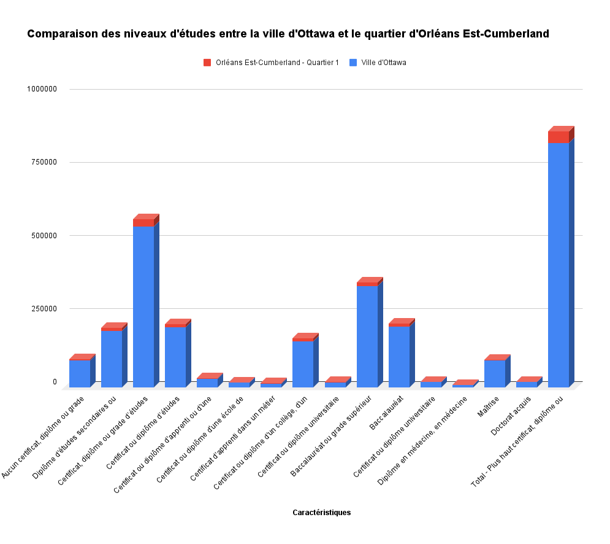

**24 octobre 2025** 
**JOU4500 - Journalisme numérique II** 
**Félix Pilon, Rose Grzela et Junior Cédric Assue** 
**Présenté à Jean-Sébastien Marier** 

# Analyse exploratoire de données (AED) et proposition

## 1. Introduction

Nous allons analyser des données sur le plus haut certificat, diplôme ou grade obtenu par la population âgée de 15 ans et plus dans les ménages privés d'Ottawa. Ces données proviennent d'un jeu de données de la Ville d'Ottawa mis à jour pour la dernière fois le 14 août 2024. Il se base sur le questionnaire recensement canadien détaillé de 2021 réalisé par Statistique Canada. Celui-ci a été envoyé à 25 % des ménages du Canada. Ce qui sera intéressant avec ces données sera de constater quels quartiers ou communautés d'Ottawa contiennent les citoyens les plus ou moins éduqués.

Le jeu de données original de la Ville d'Ottawa peut être retrouvé sur [ce lien](https://ouverte.ottawa.ca/datasets/ottawa::questionnaire-d%C3%A9taill%C3%A9-du-recensement-de-2021-donn%C3%A9es-par-quartier/about).

La version en CSV, prête à être importée dans Google Feuilles de calcul, se trouve [ici](https://raw.githubusercontent.com/jsmarier/files-for-course-assignments/refs/heads/main/Questionnaire_d%C3%A9taill%C3%A9_du_recensement_de_2021_Donn%C3%A9es_par_quartier.csv).

Dans ce travail, nous allons d'abord faire des observations générales sur les données. Ensuite, nous allons aller plus loin en réalisant une analyse VIMA qui nous permettra d'évaluer la qualité, l’exactitude et la fiabilité. Nous allons par après les nettoyer pour garantir leur cohérence et aussi exécuter une analyse exploratoire des données (AED). Avant de conclure notre travail, nous allons proposer un récit potentiel en lien avec notre jeu de données. 

## 2. Obtenir les données

D'abord, nous avons importé les données dans l'outil Google Feuilles de calcul en téléchargeant le fichier en format CSV depuis Brightspace. Pour y arriver, il faut faire un clic droit dans la page web et cliquer sur *Enregistrer sous*. Ensuite, dans Google Feuilles de calcul, il faut aller dans le menu *Fichier* et cliquer sur *Importer*.

Voici ce que ça donne et le [lien](https://docs.google.com/spreadsheets/d/1n6u9YcId6_9M40IpYNTZEE7qXEqNcJYxlNoqJJsuAGE/edit?usp=sharing) pour consulter le jeu de données : 

 

On constate qu'il y a beaucoup d'informations : 16 lignes et 26 colonnes contenant des données. Heureusement, elles semblent être assez propres. Il ne semble pas y avoir de fautes d'orthographe dans les colonnes, les chiffres sont bien placés dans les différentes cases et rien ne semble sortir du lot.

On voit toutefois que certaines variables dans les lignes (comme les lignes 7, 9 ou 14) sont placées en retrait. En fait, il ne s'agit pas d'une erreur. C'est parce que cette variable est une sous-catégorie plus précise de la variable qui se trouve juste au-dessus. Il n'y a donc rien à nettoyer à cet endroit.

Portons une attention particulière à certaines colonnes.

La colonne A appelée *Caractéristiques* contient tous les noms des plus hauts types de diplômes obtenus par les résidents des différents quartiers de la Ville d'Ottawa. Plus on descend dans la liste, plus le diplôme est important.

La colonne B appelée *Ville d'Ottawa* contient le nombre de résidents dans tout le territoire de la ville qui ont complété un diplôme. Donc, vis-à-vis la case B2, on connaît le nombre de citoyens d'Ottawa qui ont répondu au questionnaire qui n'ont aucun diplôme.

La colonne C appelée *Orléans Est-Cumberland - Quartier 1* part du même principe que la colonne B mais seulement pour les résidents du quartier 1. Les autres colonnes à sa droite contiennent des données spécifiques pour les différents quartiers de la Ville d'Ottawa.

## 3. Comprendre les données

### 3.1. Analyse VIMA

L’évaluation de l’exactitude des données est un aspect important du processus d’analyse. 

L'exactitude est l'une des six dimensions de la qualité des données qui sont prises en compte dans une analyse statistique. Les données sont exactes lorsqu'elles décrivent adéquatement les phénomènes qu’elles sont conçues pour mesurer ou représenter.

Avant d'utiliser nos données, nous les explorerons pour en apprendre davantage sur les variables et les concepts, et aussi pour découvrir si elles comportent des erreurs, des incohérences ou des lacunes.

Pour explorer la validité de nos données, nous effectuerons une analyse VIMA. Notre analyse VIMA s’appliquera sur les plus hauts diplômes obtenus par quartier à Ottawa, le but est d’évaluer la qualité, l’exactitude et la fiabilité des données avant toute interprétation statistique ou cartographique.
 
Les diplômes sont bien hiérarchisés dans la colonne Caractéristiques (du plus bas « aucun diplôme », au plus haut – « doctorat »). Cette catégorisation est logique et complète. Le Quartier 1 de Orléans Est-Cumberland spécifiquement, présente 4275 sans diplôme. Soit approximativement 10,5 % comparable à la moyenne urbaine. Les données sont logiquement cohérentes, structurées et reflètent une progression éducative réaliste. Elles sont valides.
 
Aucune valeur explicite n’est invalide, mais les sous-catégories de métiers (« certificat d’apprenti », « autre qu’un certificat d’apprenti ») pourraient doubler les mêmes répondants dans la catégorie supérieure, selon la définition utilisée par Statistique Canada. Il faudrait peut-être valider la source méthodologique du questionnaire de recensement pour s’assurer de l’exclusivité des catégories.
 
Aucune cellule vide n’est relevée, et toutes les catégories sont couvertes.
 
Aucune valeur extrême irréaliste. Les 13 410 résidents titulaires d’un baccalauréat sur 40 600 adultes représentent environ 33 %, ce qui est quand même élevé, mais plausible pour un quartier, qu’on pourrait qualifier : à haut niveau socio-économique (Orléans). En gros, il n’y a aucune surreprésentation anormale détectée.
 
Les données fournies présentent une excellente validité interne : elles sont complètes, proportionnées et réalistes. Notre analyse de fiabilité VIMA conclut donc à des données de haute qualité statistique et prêtes pour la visualisation cartographique ou l’analyse comparative entre quartiers d’Ottawa.

### 3.2. Nettoyer les données

Notre jeu de données était assez propre. Toutefois, nous l’avons tout de même nettoyé. Nous avons sélectionné la première ligne, l’avons entièrement mise en gras, puis nous l’avons figée en allant dans le menu *Affichage*, *Figer*, et en choisissant « 1 ligne ». Nous avons aussi figé la première colonne, selon le même principe, mais cette fois en choisissant « 1 colonne ».

Nous avons également créé des filtres sur la première ligne en cliquant sur *Données* puis sur *Créer un filtre*. Dans la colonne A (Caractéristiques), nous avons aussi réajusté manuellement l’alignement du texte de chaque ligne, car certaines étaient décalées vers la droite.

Finalement, nous avons sélectionné l’ensemble de notre jeu de données et double-cliqué sur l’espace blanc entre les colonnes afin que celles-ci aient la bonne largeur. Ainsi, tout le contenu était visible avant l’outil filtre.

 

### 3.3. Analyse exploratoire des données (AED)

Nous avons choisi de comparer les niveaux de scolarité atteints parce que les diplômes sont un indicateur central de la composition socioéconomique d’une population : ils influencent le marché du travail, le revenu, le type d’emploi, la mobilité sociale et l’attractivité d’un quartier, par exemple.
 
Ce choix répond à l’un des usages classiques de l’analyse exploratoire en démographie : repérer comment un quartier se situe par rapport à la ville et détecter s’il présente un profil « en avance », « en retard » ou « typique ».​
 
Spécifiquement pour Orléans Est–Cumberland, nous avons, 40 600 résidents âgés de 15 ans et plus. 4 275 sans diplôme (10,5 % du quartier ; contre 11 % pour la ville d’Ottawa). 10 650 avec un diplôme d’études secondaires (26,2 %). 25 675 avec un diplôme postsecondaire (63,3 %). 8 905 titulaires d’un baccalauréat (21,9 %) et 2 965 avec une maîtrise, soit 7,3 % du quartier.

En ce qui concerne la ville d’Ottawa : 834 140 résidents ont 15 ans et plus, 92 040 sans diplôme (11 %), 192 095 avec un diplôme d’études secondaires (23 %), 550 005 avec un diplôme postsecondaire (66 %), 208 395 titulaires d’un baccalauréat (25 %) et 91 825 avec une maîtrise (11 %).

Il en ressort qu’Orléans Est–Cumberland affiche un fort taux de diplomation postsecondaire, même s’il demeure légèrement inférieur à la moyenne municipale (63 % vs 66 %). La part de diplômés universitaires (maîtrises, doctorats) est notablement plus faible à Orléans que dans l’ensemble d’Ottawa : par exemple, il y a deux fois moins de titulaires de maîtrise (7,3 % contre 11 %) et de doctorat (1,3 % contre 2,2 %). Le quartier Orléans Est–Cumberland compte une plus forte part de diplômés de collèges ou cégeps.
 
Orléans Est–Cumberland est un quartier dont la population est éduquée et stable, mais le profil diffère de quartiers centraux d’Ottawa : il y a davantage de ménages de la classe moyenne technique ou administrative (collège, métiers), et moins d’universitaires. Cela suggère un quartier résidentiel familial, attractif pour des travailleurs qualifiés, mais avec une moindre attractivité pour les expatriés diplômés du supérieur ou la population universitaire. Ce profil éducatif influence possiblement le type de services, d’activités collectives, d’emploi local, et même les enjeux politiques ou sociaux portés par la communauté.
 
Toutefois, une analyse de la structuration du secteur d’emploi (secteur public, technique, commercial, santé, etc.) en fonction du diplôme obtenu, de l’origine géographique (immigration vs natifs), afin de vérifier la répercussion sur la diversité linguistique ou culturelle ainsi qu’une comparaison avec d’autres quartiers (centraux et périphériques) pour situer précisément la singularité d’Orléans pourraient être des éléments qui méritent une analyse plus poussée.
 
En résumé, l’analyse exploratoire montre qu’Orléans Est–Cumberland se distingue par une population instruite, portée par le collège/cégep et les métiers, mais reste à la traîne d’Ottawa pour les études universitaires supérieures, ce qui influence probablement son positionnement socio-économique et démographique. Une analyse plus poussée porterait sur la relation entre niveau de scolarité, secteur d’activité professionnelle et mobilité sociale dans le quartier.
 
 
 

## 4. Récit potentiel

Nous pourrions nous concentrer sur la répartition des niveaux de scolarité dans les quartiers d’Ottawa et ce que ces données révèlent. En utilisant les données sur le niveau de formation des habitants de chaque quartier, nous pourrions créer une carte thématique qui montre la diversité des parcours éducatifs dans la ville. Cette carte permettrait de voir les écarts éducatifs entre les quartiers et d’examiner certains facteurs possibles, comme la proximité des écoles et universités, les réalités socioéconomiques ou le type de développement urbain.

Pour raconter cette histoire, nous utiliserons d’abord les données disponibles sur le niveau de scolarité dans chaque quartier. Nous aurons également besoin de quelques informations supplémentaires, comme l’emploi des habitants et la proximité des écoles et universités. Enfin, nous pourrions regarder des rapports de la ville ou des études sur l’éducation et le développement urbain pour mieux comprendre le contexte et ajouter des informations à notre analyse.

Pour appuyer le projet, nous pourrions interviewer : un responsable municipal en urbanisme ou en développement économique, un spécialiste en éducation ou en études urbaines, ainsi que des résidents de différents quartiers pour connaître leur point de vue sur l’impact de l’éducation dans leur vie ou dans leur communauté.

Parmi les sources pertinentes déjà identifiées : [des statistiques démographiques d’Ottawa](https://ottawa.ca/fr/vivre-ottawa/statistiques-et-donnees-demographiques#), [un rapport qui analyse comment les niveaux de scolarité diffèrent d’un quartier à l’autre à Ottawa](https://www.perspectivesottawa.ca/themes/education-et-apprentissage/le-succes-avant-et-apres-les-etudes/) et [une étude qui porte sur la mobilité intergénérationnelle du niveau de scolarité](https://www.proquest.com/docview/203665088?accountid=14701&cid=CID:20251104205404944:342718&fromOL=true&fromopenview=true&parentSessionId=irNC6%2FqVGtLbuJr8BoIKZIgsXsebxXT%2BQyuJI97yKmw%3D&pq-origsite=gscholar&sourcetype=Scholarly%20Journals). 

## 5. Conclusion

Ce travail nous a permis d’explorer de façon structurée la qualité et la valeur analytique des données sur le niveau de scolarité à Ottawa. Le processus nous a conduits à examiner la validité des données et de faire un nettoyage de base. 

Le plus gratifiant a été de remarquer que l’analyse des données permet de mieux comprendre les différences de scolarité entre les quartiers. Cela aide aussi à identifier des tendances importantes qui pourraient servir à guider des décisions dans la communauté. 

Un point difficile a été d’accepter que les données ne montrent pas tout. Même si les chiffres sur les niveaux de scolarité sont détaillés, ils ne reflètent pas des éléments importants, comme l’expérience de travail, les compétences développées sur le terrain ou d’autres formes d’apprentissage. Ces aspects peuvent avoir un impact majeur sur la réalité socioéconomique d’un quartier. Ne pas pouvoir inclure ces nuances laisse certaines zones grises et oblige à rester prudent dans l’analyse.

Une chose que nous aurions pu faire différemment serait de comparer les données d’Ottawa avec celles d’autres villes. Cette comparaison aurait permis d’avoir un contexte plus large et de mieux comprendre si les tendances observées à Ottawa sont particulières à cette ville ou si elles se retrouvent dans d’autres régions. 

## 6. Références

De Broucker, P., & Underwood, K. (1998). Mobilite intergenerationnelle du niveau de scolarite : Une comparaison internationale axee sur les etudes postsecondaires. *Education Quarterly Review, 5*(2), 30‑51. Canadian Business & Current Affairs Database.

Perspectives Ottawa. (s. d.). *Le succès avant et après les études.* https://www.perspectivesottawa.ca/themes/education-et-apprentissage/le-succes-avant-et-apres-les-etudes/

Ville d’Ottawa. (s. d.). *Statistiques et données démographiques.* https://ottawa.ca/fr/vivre-ottawa/statistiques-et-donnees-demographiques#

Ville d’Ottawa. (2023). *Questionnaire détaillé du recensement de 2021—Données par quartier* [Dataset]. https://ouverte.ottawa.ca/datasets/ottawa::questionnaire-d%C3%A9taill%C3%A9-du-recensement-de-2021-donn%C3%A9es-par-quartier/about
