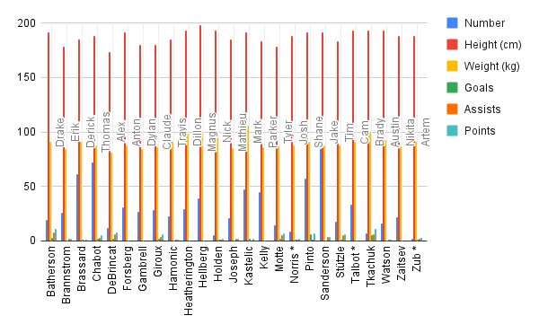

**24 octobre 2025**<br>
**JOU4500 - Journalisme numérique II**<br>
**Félix Pilon, Rose Grzela et Junior Cédric Assue**<br>
**Présenté à Jean-Sébastien Marier**<br>

# Analyse exploratoire de données (AED) et proposition

## 1. Introduction

Nous allons analyser des données sur le plus haut certificat, diplôme ou grade obtenu par la population âgée de 15 ans et plus dans les ménages privés d'Ottawa. Ces données proviennent d'un jeu de données de la Ville d'Ottawa mis à jour pour la dernière fois le 14 août 2024 qui se base sur le questionnaire recensement canadien détaillé de 2021 réalisé par Statistique Canada. Celui-ci a ét envoyé à 25 % des ménages du Canada. Ce qui sera intéressant avec ces données sera de constater quels quartiers ou communautés d'Ottawa contiennent les citoyens les plus ou moins éduqués.

Le jeu de données original de la Ville d'Ottawa peut être retrouvé sur [ce lien](https://ouverte.ottawa.ca/datasets/ottawa::questionnaire-d%C3%A9taill%C3%A9-du-recensement-de-2021-donn%C3%A9es-par-quartier/about).

La version en CSV, quant à elle, se trouve [ici](https://raw.githubusercontent.com/jsmarier/files-for-course-assignments/refs/heads/main/Questionnaire_d%C3%A9taill%C3%A9_du_recensement_de_2021_Donn%C3%A9es_par_quartier.csv).

Dans ce travail, nous allons d'abord faire des observations générales sur les données dans la section *Obtenir les données*. Ensuite, nous allons aller plus loin en réalisant un analyse VIMA dans la section *Comprendre les données* qui nous permettra d'évaluer la qualité, l’exactitude et la fiabilité. Nous allons par après les nettoyer pour garantir leur cohérence et et aussi exécuter une analyse exploratoire des données (AED). Avant de conclure notre travail, nous allons proposer un récit potentiel en lien avec notre jeu de données. 

## 2. Obtenir les données

Utilisez deux croisillons (`##`) pour créer un intertitre de niveau 2 comme celui-ci.

Utilisez le modèle de code ci-dessous pour insérer une capture d'écran. Vos images doivent être sauvegardées dans le même dossier que votre fichier `.md`.

<br>
*Figure 1 : La fenêtre d'importation d'un fichier de Google Feuilles de calcul.*

**Voici quelques exemples de fonctions et de lignes de code mises dans des boîtes grises :**

1. Si vous nommez une fonction, mettez là à l'intérieur de guillemets « inclinés » comme ceci : `IMPORTHTML`.
1. Si vous voulez inclure une ligne de code complète, faites la même chose, mais avec tout le code : `=IMPORTHTML("https://en.wikipedia.org/wiki/China"; "table", 5)`.
1. Alternativement, vous pouvez mettre le code dans une boîte indépendante en utilisant le modèle de code ci-dessous :

``` r
=IMPORTHTML("https://en.wikipedia.org/wiki/China"; "table", 5)
```
C'est aussi comme ça qu'on crée une liste ordonnée. Il suffit de mettre `1.` devant chaque item.

## 3. Comprendre les données

### 3.1. Analyse VIMA

Utilisez trois croisillons (`###`) pour créer un intertitre de niveau 3 comme celui-ci. Je vous prie de suivre ce modèle en ce qui a trait aux intertitres de niveaux 1 et 2. Toutefois, je vous laisse le loisir d'utiliser les intertitres de niveau 3 comme bon vous semble.

Insérez votre texte ici.

Appuyez vos affirmations en citant les sources appropriées. Veuillez suivre les [normes APA en matière d'attribution dans le corps du texte](https://apastyle.apa.org/style-grammar-guidelines/citations).

**Par exemple :**

Comme l'affirme Cairo (2016), une visualisation de données doit être véridique...

### 3.2. Nettoyage des données

Insérez votre texte ici.

### 3.3. Analyse exploratoire des données (AED)

Insérez votre texte ici.

**Cette section doit inclure une capture d'écran de votre tableau croisé dynamique, comme ceci :**

<br>
*Figure 2 : Ce tableau croisé dynamique montre...*

**Cette section doit aussi inclure une capture d'écran de votre graphique exploratoire, comme ceci :**

<br>
*Figure 3 : Ce graphique exploratoire montre...*

## 4. Récit potentiel

Insérez votre texte ici.

## 5. Conclusion

Insérez votre texte ici.

## 6. Références

Veuillez inclure une liste de vos références ici. Assurez-vous de suivre les [normes APA pour les références](https://apastyle.apa.org/style-grammar-guidelines/references). Les retraits négatifs (*hanging paragraphs*) ne sont pas nécessaires. Le [guide sur l'adaptation APA](https://arts.uottawa.ca/lettres/sites/arts.uottawa.ca.lettres/files/cartu-outils-de-redaction-adaptation-apa.pdf) de l'Université d'Ottawa pourrait également vous être utile.

**Voici un exemple :**

Bounegru, L., & Gray, J. (Eds.). (2021). *The Data Journalism Handbook 2: Towards A Critical Data Practice*. Amsterdam University Press. [https://ocul-crl.primo.exlibrisgroup.com/permalink/01OCUL_CRL/hgdufh/alma991022890087305153](https://ocul-crl.primo.exlibrisgroup.com/permalink/01OCUL_CRL/hgdufh/alma991022890087305153)
